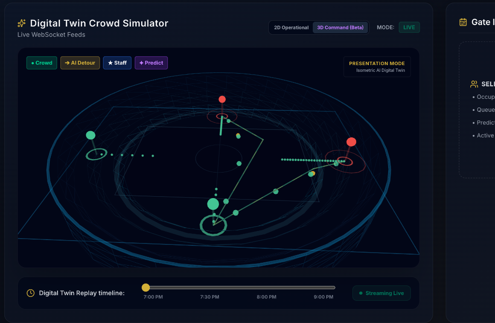

# 🏟️ CrowdPilot AI

<div align="center">

### AI-Powered Digital Twin for FIFA World Cup 2026 Stadium Operations

[](https://react.dev/)
[](https://fastapi.tiangolo.com/)
[](https://www.python.org/)
[](https://threejs.org/)
[](https://ai.google.dev/)
[]()
[](LICENSE)
[]()

**CrowdPilot AI** is an agentic AI platform that helps stadium operators **monitor, predict, and respond** to crowd situations in real time using a **Digital Twin**, **Multi-Agent AI**, and **Live Telemetry**.

</div>

---

## 🏆 PromptWars 2026 Submission

**Vertical:** Smart Stadiums & Tournament Operations (FIFA World Cup 2026)

### ✨ Key Features

* 🧠 **Multi-Agent AI Orchestrator:** Dynamic cooperation between specialized operational agents (Crowd, Incident, Logistics, Comms, and Governance).
* 🏟️ **Live 2D & 3D Digital Twin:** Double-view holographic command map rendering flow particles, scanner sweeps, and real-time response unit navigation.
* 📡 **Real-time WebSocket Telemetry:** Live updates on gate densities, transit flows, and incident states streaming directly from the simulator.
* 🚨 **AI Incident Response & Simulation:** Triage panel for active emergencies (fires, storms, medical dispatches) with instant scenario forecasting.
* 📈 **Predictive Crowd Analytics:** Automated forecasting of cascading corridor overloads and ingress bottlenecks before they occur.
* 🛡️ **Governance Shield & SLA Lockout:** Invariant safety rules sandbox that halts autonomous AI execution and triggers operator overrides if safe limits are breached.
* 📢 **Web Speech Audio Dispatcher:** Voice synthesis dispatcher reading live emergency alerts and PA broadcasts in a premium operational tone.
* 🔁 **Historical Replay Timeline:** Seamless temporal scrubbing that smooths/LERPs stadium states to review historical events.

---

## 🏗️ Architecture

```text
        React + TypeScript
                │
       REST API + WebSockets
                │
        FastAPI Backend
                │
      AI Orchestrator (Gemini)
                │
 ┌──────────────┼──────────────┐
 │              │              │
Crowd      Incident      Logistics
 Agent        Agent         Agent
 │              │              │
 └──────────────┼──────────────┘
                │
      Digital Twin Simulator
```

### Component Roles & Logic
* **FastAPI Backend Gateway (`backend/main.py`):** Central server interface hosting API routes for replay scrubbing, autonomy changes, plan deployments, and managing open WebSocket streams.
* **Telemetry Simulator (`backend/simulator.py`):** Handles deterministic, local state walks (inflows, parking loads, transit increments, and SLA timers) on a separate thread, saving API costs.
* **Agentic Queue Manager (`backend/agents/agentic_core.py`):** Drives multi-agent perception loops, queues mitigation proposals, runs governance checks, and verifies action results.
* **UI Command Console (`frontend/src/`):** A high-fidelity operator interface rendering the interactive SVG and React Three Fiber 3D wireframe digital twin dashboards.

---

## 🤖 AI Decision Workflow

```text
Observe
   ↓
Analyze
   ↓
Predict
   ↓
Recommend
   ↓
Governance Check
   ↓
Execute
   ↓
Verify
```

1. **Observe:** Continuous telemetry analysis of gate capacities and safety indices.
2. **Analyze & Predict:** Identifying bottlenecks (Gate occupancy $\ge 90\%$) and active threats.
3. **Recommend:** Multi-agent assembly of mitigation plans (signage reroutes, backup transport, steward positioning).
4. **Governance Check:** Verifying actions against core safety policies (blocking multi-gate closures).
5. **Execute:** Dispatching units and publishing announcements.
6. **Verify:** Post-action automated telemetry auditing to close the loop.

---

## 🛠️ Tech Stack

| Frontend | Backend | AI | Visualization |
|----------|----------|----|---------------|
| React 19 | FastAPI | Google Gemini | SVG Digital Twin |
| TypeScript | Python 3.11+ | Multi-Agent AI | React Three Fiber |
| Tailwind CSS | WebSockets | AI Orchestrator | Three.js |
| Framer Motion | Uvicorn | Web Speech API | OrbitControls |

---

## 🚀 Getting Started

### Backend Setup

1. **Configure Environment Variables:**
   Create a `.env` file inside `backend/`:
   ```env
   GEMINI_API_KEY=your_gemini_api_key_here
   SIMULATION_TICK_INTERVAL=0 # Set to override loop speed (in seconds). 0 defaults to dev (4s) / prod (12s)
   SLA_BREACH_THRESHOLD=0     # Set to override SLA breach timer (in seconds). 0 defaults to dev (20s) / prod (60s)
   ```

2. **Run Backend Gateway:**
   ```bash
   cd backend
   python3 -m venv venv
   source venv/bin/activate
   pip install -r requirements.txt
   uvicorn main:app --reload --port 8000
   ```
   Server runs at `http://localhost:8000`.

### Frontend Setup

1. **Run Client Console:**
   ```bash
   cd frontend
   npm install
   npm run dev
   ```
   Open `http://localhost:5173` in your browser.

---

## 🎯 Why CrowdPilot AI?

Unlike traditional dashboards that only display metrics, **CrowdPilot AI** explains:

* ✅ **What's happening:** Real-time crowd mapping and incident coordinates.
* 🔍 **Why it's happening:** Structural breakdown of capacity metrics.
* 📈 **What will happen next:** Multi-gate cascading overflow prediction.
* 🤖 **What action should be taken:** Drafted PA comms and responder dispatch coordinates.
* 🛡️ **Why the recommendation is safe:** Direct compliance reporting via the Governance Shield.

Helping operators make **faster, safer, and AI-assisted decisions** during live stadium operations.

---

## 📂 Project Structure

```text
CrowdPilot/
├── backend/
│   ├── agents/          # Multi-Agent logic & risk constraints
│   ├── main.py          # FastAPI Gateway routes
│   └── simulator.py     # Deterministic simulation loops
├── frontend/
│   ├── src/
│   │   ├── components/  # 2D/3D map, timelines, dashboards
│   │   ├── context/     # React state and WebSocket hook
│   │   └── utils/       # Translations and helpers
└── README.md
```

---

## 🎯 Assumptions Made
* **Gate Adjacency Network:** We assume stadium entrances are arranged in a circular perimeter network (Gate A connected to B/D, B to A/C, C to B/D, D to A/C). Crowds rerouted from blocked doors are pushed to the nearest adjacent gate with low capacity.
* **Autonomy SLA Constraints:** We assume a gate occupancy $\ge 90\%$ is a critical threat. The safety SLA response window is assumed to be 20 seconds under local development and 60 seconds in cloud production environments.
* **Token & Cost Optimizations:** To avoid token exhaustion and Gemini rate limits, complex reasoning analysis is manually triggered by the operator on-demand (e.g. "Run AI Analysis"), while simple telemetry checks run locally.
* **Privacy Controls:** We assume all incoming spectator telemetry data is pre-aggregated at gate transit points, containing no personally identifiable information (PII).

---

## 🔒 Security & Safe Practices
* **CORS Access Protections:** CORS rules are strictly locked down to your production domain and local development server (`http://localhost:5173` and `https://crowd-pilot-ai-nine.vercel.app`), preventing malicious cross-origin requests.
* **Sanitized React Nodes:** The UI utilizes standard JSX bindings throughout, mitigating Cross-Site Scripting (XSS) by preventing injection of unescaped text.
* **No Database Exposure:** All simulation steps are managed in-memory with strict Pydantic model schemas, eliminating SQL Injection (SQLi) risks.

---

## 📸 Screenshots

### Immersive 3D Digital Twin (Presentation Mode)


---

## 📜 License

MIT License
